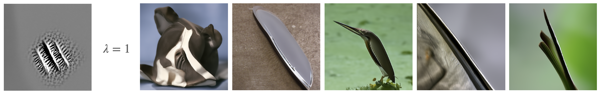

# 🪙 DIME: Diffusion Induced Most Exciting inputs 
Diffusion Induced Most Exciting inputs



*This repository is based on the [guided-diffusion](https://github.com/openai/guided-diffusion) repository.*

# Installation
## Package Requirements
You can install the required packages by running:
```bash
pip install -e .
```

To run neural experiments you need to install the [nnvision](https://github.com/sinzlab/nnvision.git) package.
```bash
mkdir lib
git clone -b model_builder https://github.com/sinzlab/nnvision.git ./lib/nnvision
pip install -e ./lib/nnvision
```

## Pre-trained model weights
To run DIME you need to download the pre-trained weights of the ADM model.
The experiments use a model pretrained by OpenAI on 256x256 ImageNet images.

| Model                   | Weights |
|-------------------------| --- |
| ImageNet 256x256 uncond | [256x256_diffusion_uncond.pt](https://openaipublic.blob.core.windows.net/diffusion/jul-2021/256x256_diffusion_uncond.pt) |

place the weights in the `models` folder.

# Usage
Here is a minimal example for running the DIME algorithm on a pretrained model.
```python
import torch
from guided_diffusion.script_util import create_model_and_diffusion, model_and_diffusion_defaults

# Model settings
model_config = model_and_diffusion_defaults()
model, diffusion = create_model_and_diffusion(**model_config)

model.load_state_dict(torch.load('./models/256x256_diffusion_uncond.pt', map_location='cpu'))

model.requires_grad_(True).eval().to(device)
if model_config['use_fp16']:
    model.convert_to_fp16()

energy_scale = 1.0 # energy scale for the DIME algorithm
def energy_fn(pred_x_0):
    """
    Energy function for the DIME algorithm. Defines the optimization objective.
    
    Args:
        x (torch.Tensor): predicted sample at step t = 0. Shape: (B, C, H, W)
    """
    return torch.norm(pred_x_0)

samples = diffusion.p_sample_loop_progressive(
    model,
    (1, 3, model_config['image_size'], model_config['image_size']),
    clip_denoised=False,
    model_kwargs={},
    progress=False,
    energy_fn=energy_fn,
    energy_scale=energy_scale,
)

```