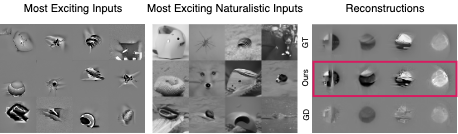

# 🥚 EGG: Energy Guided Diffusion for optimizing neurally exciting images

This is the official implementation of the paper "Energy Guided Diffusion for Generating Neurally Exciting Images" accepted at NeurIPS 2023.

<p align="center"></p>

> [**Energy Guided Diffusion for Generating Neurally Exciting Images**](https://www.biorxiv.org/content/10.1101/2023.05.18.541176v1), \
> Pawel A. Pierzchlewicz, Konstantin F. Willeke, Arne F. Nix, Pavithra Elumalai, Kelli Restivo, Tori Shinn, Cate Nealley, Gabrielle Rodriguez, Saumil Patel, Katrin Franke, Andreas S. Tolias, and Fabian H. Sinz
>
> [[NeurIPS]](https://neurips.cc/virtual/2023/poster/72996) [[bioRxiv]](https://www.biorxiv.org/content/10.1101/2023.05.18.541176v1)

*This repository is based on the [guided-diffusion](https://github.com/openai/guided-diffusion) repository.*

# Installation

## Package Requirements
Some packages need to be downloaded manually.
Run the following commands to download the required packages:
```bash
./download_requirements.sh
```

You can install the remaining packages by running:
```bash
pip install -e ./lib/nnvision
pip install -e ./lib/mei
pip install -e .
```

## Pre-trained model weights
To run EGG you need to download the pre-trained weights of the ADM model.
The experiments use a model pretrained by OpenAI on 256x256 ImageNet images.

| Model                   | Weights                                                                                                                  |
|-------------------------|--------------------------------------------------------------------------------------------------------------------------|
| ImageNet 256x256 uncond | [256x256_diffusion_uncond.pt](https://openaipublic.blob.core.windows.net/diffusion/jul-2021/256x256_diffusion_uncond.pt) |
| Attention Readout + Data Driven Core | [HuggingFace](https://huggingface.co/sinzlab/attention-readout-monkey-v4)                                               |

place the weights in the `models` folder.

# Usage
Here is a minimal example for running the EGG diffusion on a pretrained model.

```python
from functools import partial

import torch


from egg.models import models
from egg.diffusion import EGG

# Setup the parameters
energy_scale = 5
num_samples = 1
num_steps = 50
device = 'cuda' if torch.cuda.is_available() else 'cpu'

def energy_fn(pred_x_0, unit_idx=0, contrast=50):
    """
    Energy function for optimizing MEIs, i.e. images that maximally excite a given unit.

    :param pred_x_0: the predicted "clean" image
    :param unit_idx: the index of the unit to optimize
    :param contrast: the contrast of the image
    :return: the predicted neural response of the predicted image for the given unit
    """
    x = F.interpolate(
        pred_x_0.clone(), size=(100, 100), mode="bilinear", align_corners=False
    ).mean(1, keepdim=True) # resize to 100x100 and convert to grayscale
    
    x = x / torch.norm(x) * contrast
    
    return dict(train=-models['task_driven']['train'](x)[..., unit_idx])


diffusion = EGG(
    diffusion_artefact='./models/256x256_diffusion_uncond.pt',
    num_steps=num_steps
)

samples = diffusion.sample(
    energy_fn=partial(energy_fn, unit_idx=0),
    energy_scale=energy_scale
)
```

# Reproducing the experiments
First the docker image needs to be built:
```bash
docker compose build base
```
This will setup the docker image with all the required packages.
This will take a while, but only needs to be done once.

The experiments can then be reproduced by running the scripts in the `scripts` folder.
For example, to reproduce the experiments generating MEIs using EGG run:
```bash
docker compose run --rm python scripts/meis_egg.py
```

Finally, the analysis of the results and plots can be found in the `notebooks` folder.

# Citation
If you find this repository useful for your research, please cite the following paper:
```
@article{Pierzchlewicz2023,
  title    = "Energy Guided Diffusion for Generating Neurally Exciting Images",
  author   = "Pierzchlewicz, Pawe{\l} A and Willeke, Konstantin F and Nix, Arne
              F and Elumalai, Pavithra and Restivo, Kelli and Shinn, Tori and
              Nealley, Cate and Rodriguez, Gabrielle and Patel, Saumil and
              Franke, Katrin and Tolias, Andreas S and Sinz, Fabian H",
  abstract = ",
  journal  = "bioRxiv",
  pages    = "2023.05.18.541176",
  month    =  may,
  year     =  2023,
  language = "en"
}
```